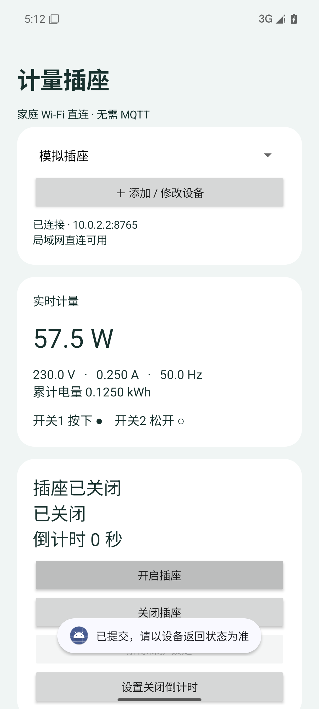

# 计量插座 · MeteringSocket

基于 **ESP32-C3 + BL0942** 的计量插座软件：PlatformIO Arduino 固件、原生中文 Android App，以及可选的 Home Assistant MQTT 接入。

手机在家庭 Wi-Fi 内直接连接设备，**不需要 MQTT、电脑或云服务器**。MQTT 用于 HA 自动发现和控制；离家可使用 HA 已有的安全远程入口或家庭 VPN。

> 当前版本1.0.0。固件构建、原生测试、Android35模拟器及Docker HA模拟联测通过；尚未完成自焊实板、真实BL0942、继电器及Flash OTA验收。仓库包含软件和接线定义，不包含可直接投产的PCB。

## 功能

- 一路高电平有效继电器、两路按下为true的微动开关。
- 电压、电流、有功功率、频率、累计电量；失联显示无效读数。
- 手动、单路允许、AND/OR允许、AND/OR自动跟随，共七种规则。
- 关闭倒计时、每日定时、过流/功率保护，故障与暂停分别管理。
- 原生中文Android8+ App：多设备、配对、计量、控制、设置、OTA。
- 热点配网、令牌认证HTTP API、简易浏览器控制页。
- MQTT Home Assistant九实体自动发现、在线状态和离线遗嘱。
- 配置和电量周期保存、双OTA分区、独立安全控制任务。

## 下载与开始

- [安卓 APK（调试签名）](dist/meteringsocket-debug.apk)
- [首次烧录整片镜像](dist/meteringsocket-factory.bin)
- [OTA 应用固件](dist/firmware.bin)
- [SHA-256 校验值](dist/SHA256SUMS.txt)

GitHub文件页选择下载原始文件；不要将首次烧录镜像上传到OTA。

1. 按[接线定义](docs/PINS.md)准备ESP32-C3，按[构建与烧录](docs/BUILD.md)烧录。
2. 手机接入 `MeteringSocket-…`，密码 `socketsetup`；重新配网长按GPIO0按钮三秒。
3. 安装APK，添加 `192.168.4.1`，点“从热点首次配对”，保存设备。
4. App填写家庭2.4GHz Wi-Fi；手机切回家庭Wi-Fi，将当前设备地址更新为路由器分配的IP。
5. 计量有效后解除锁定；手动模式再开启，跟随模式按输入自动输出。

详见[用户手册](docs/USER_GUIDE.md)。热点开放十分钟；令牌只允许在配网模式通过设备热点读取。



## 引脚速查

| 信号 | GPIO | 默认行为 |
|---|---:|---|
| 继电器输出 | 3 | HIGH开启，LOW关闭 |
| 微动开关1 / 2 | 4 / 5 | 上拉，闭合到CTRL_GND为true |
| BL0942 UART RX / TX | 6 / 7 | 4800bps、8N1，经隔离通信 |
| CF1预留 | 10 | 当前固件不使用 |
| 配网按钮 | 0 | 闭合到CTRL_GND，长按三秒 |

GPIO号不是封装脚号。USB18/19、下载串口20/21、启动和Flash脚保留。裸芯片要求、继电器输入下拉及隔离边界见[PINS.md](docs/PINS.md)。

## 文档

| 文档 | 内容 |
|---|---|
| [用户手册](docs/USER_GUIDE.md) | 安装、配对、联动、定时、保护、校准、升级 |
| [GPIO与接线](docs/PINS.md) | 引脚、隔离信号、裸芯片、复位电平 |
| [构建与烧录](docs/BUILD.md) | 环境、PIO、Android、整片/OTA镜像、校验 |
| [Home Assistant](docs/HOME_ASSISTANT.md) | MQTT、Docker、自动发现、远程、模拟联测 |
| [HTTP / MQTT API](docs/API.md) | 接口、字段、错误、示例、主题 |
| [软件架构](docs/ARCHITECTURE.md) | 控制状态、任务、计量、持久化 |
| [故障排查](docs/TROUBLESHOOTING.md) | 配网、联动、计量、MQTT、OTA、构建 |
| [测试与验收](docs/TESTING.md) | 原生测试、安卓模拟器、HA、实板步骤 |
| [验证记录](docs/VERIFICATION.md) | 已运行检查与未实测项 |
| [安全说明](SECURITY.md) | 凭据、网络、OTA、公开提交检查 |
| [参与开发](CONTRIBUTING.md) | 修改与验证要求 |
| [版本记录](CHANGELOG.md) | 内容与限制 |
| [第三方说明](THIRD_PARTY_NOTICES.md) | 依赖、许可、协议参考 |

## 开发

```powershell
git clone https://github.com/topsai/metering-socket.git
cd metering-socket
pio run -d firmware
.\tools\build-android.ps1
.\tools\test-core.ps1
```

Android需要JDK17、SDK36 / Build Tools36，详见[BUILD.md](docs/BUILD.md)。原生测试使用PlatformIO MinGW；先构建固件取得ArduinoJson依赖。

```text
firmware/   PIO Arduino固件、共享控制核心和校验
android/    App、Gradle wrapper、单元与模拟器测试
tests/      原生C++测试和模拟桥接
tools/      构建、测试、模拟、公开内容检查、HA验证
docs/       使用、开发与验收文档
dist/       APK、固件、校验值和模拟界面截图
private/    本机凭据和broker配置，脚本首次生成，禁止提交
```

原创代码暂未指定开源许可；第三方组件按各自许可。公开可阅读源码，复用授权另行确定，见[第三方说明](THIRD_PARTY_NOTICES.md)。
