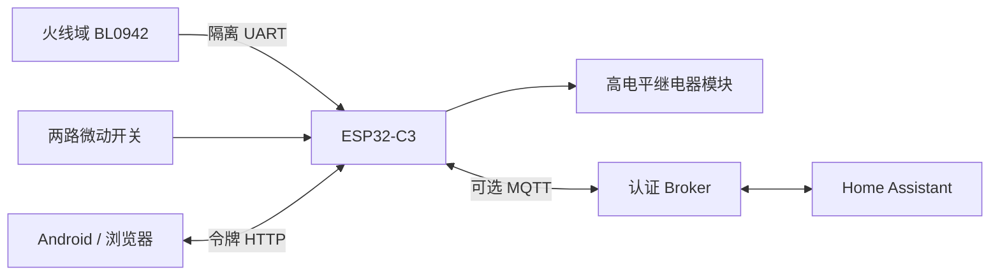

# 软件架构

[返回首页](../README.md)

## 数据路径

图中仅通信路径代表隔离；软件不能建立电气隔离，HOT_GND与CTRL_GND必须保持硬件隔离。PCB不在本仓库内。

## 模块

| 文件 | 职责 |
|---|---|
| firmware/include/core.h | 去抖、控制状态、BL0942解析、电量计数，原生测试共享 |
| firmware/include/config_validation.h | ArduinoJson配置对象、类型和范围校验 |
| firmware/include/pins.h | GPIO常量 |
| firmware/src/main.cpp | Arduino适配、任务、UART、HTTP、OTA、MQTT、NVS、定时 |
| MainActivity.java | 原生UI、轮询、局域网HTTP、multipart OTA |
| Vault.java | Android Keystore AES-GCM配置存储 |
| Endpoint.java / Streams.java | 地址校验、兼容Android 8.0（API 26）的有界读流 |
| tests/core_bridge.cpp | 本机测试桥接，共享核心，非生产固件 |

## 控制状态与优先级

`requested` 为手动、HA 或定时开启请求，`output` 为控制器的逻辑输出状态，`fault` 为真实故障锁定，`paused` 为暂停。HTTP 暴露的 `fault` 是两类锁定的合并状态，同时单独提供 `paused`。没有继电器触点反馈；OTA 期间 GPIO 还受强制拉低约束，不能把逻辑状态当作触点或引脚电压测量结果。

输出要求：没有fault、没有paused、输入条件满足，并且处于跟随模式或requested=true。

优先级：OTA禁止输出；真实故障锁定；暂停；输入允许条件；自动跟随/手动请求。OFF和条件失效撤销请求；允许模式条件恢复不自启。跟随OFF使用stop暂停，ON拒绝。复位需健康计量，清两类锁定并清请求。每日ON只能恢复暂停，不清真实故障。

控制核心保留第一个真实故障原因。倒计时在故障时取消，不解除故障；跟随倒计时到期暂停，普通模式到期清请求。部分瞬时reason会被下一次tick更新，UI不能把reason当不可变事件日志。

## 执行任务

安全任务priority4，每次读取GPIO、35ms去抖、检查五秒计量截止/阈值和输出，再等待名义5ms。创建失败则setup持续拉低GPIO，不启动HTTP/MQTT。这里的5ms是软件调度目标，不是实测硬实时保证；芯片Flash操作等仍需实物验证。

Arduino loop负责UART接收/每秒请求、HTTP、MQTT、NTP分钟调度、NVS周期写入。同步网络可能阻塞loop，但不承担安全GPIO采样。共享控制与计量用critical guard保护；JSON使用快照在锁外序列化，避免网络/堆分配占用安全锁。

## BL0942

默认UART地址0、4800bps、8N1，请求 `58 AA`，响应23字节以55开头。校验是58加前22字节的8位和异或FF。电流/电压无符号24位，功率有符号24位；频率为 `1000000/period`。

电压/电流/功率分别除以vref/iref/pref。电量来自CF_CNT增量，换算参考 `pref×3600000/419430.4` counts/kWh。首次仅建立基线；24位回卷取模，大幅增量≥100000跳过，兼顾计量芯片计数重置。该启发式不是任意掉电/失帧的精确恢复保证。

固件未提供其他BL0942波特率/地址自动探测或寄存器配置界面。SEL及BPS等硬件必须匹配；CF1预留不使用。

## 配置与认证

NVS namespace为socket，保存token、config及energy。128 位随机令牌以 32 个十六进制字符保存，配对只在十分钟setup模式且HTTP入口来自softAPIP时可读。无Wi-Fi配置建立热点；手动长按可重新开启。

状态不返回 Wi-Fi 或 MQTT 密码。配置局部更新，先校验完整请求；保存撤销手动请求、取消倒计时并主动断开 MQTT，跟随模式仍可能按条件输出。提交 SSID 时需同时显式提交 Wi-Fi 密码，详见[API](API.md)。OTA 使用有 Content-Length 的 multipart；认证通过后开始写入，结束或上传中断设置锁定，成功重启。

Android保存的设备名称、地址、token整体AES-GCM加密，轮询使用generation避免旧设备/后台响应覆盖当前状态，串行executor处理请求。局域网请求优先绑定已连接Wi-Fi网络，不依赖移动数据默认路由。

## 保留与丢失

| 内容 | 保存 | 重启行为 |
|---|---|---|
| Wi-Fi、MQTT、规则、阈值、校准、每日定时 | 修改时NVS | 恢复 |
| token | 首次NVS | 保持，擦除NVS后重建 |
| 累计电量 | 每五分钟NVS | 恢复上次保存值 |
| 请求、输出、故障、暂停、倒计时 | RAM | 重新初始化；无计量启动锁定 |
| 时间 | 系统RAM + NTP | 重新校时，非RTC |

正式固件没有事件数据库、历史曲线或用户可用的电量清零接口。启用 HA 后可由 HA 保存历史；未接入 HA 时没有持久化历史曲线。bench 环境的清零命令仅用于清理合成测试数据。
