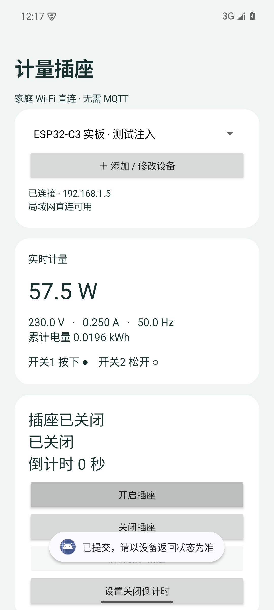

# ESP32-C3 裸开发板联测 · 2026-10-08

[返回首页](../README.md) · [全部验证记录](VERIFICATION.md)

## 测试对象与边界

COM3 接入 ESP32-C3 QFN32 rev0.4、4MB XMC Flash、40MHz 晶振开发板，只有 USB 供电。没有接 BL0942、微动开关、继电器或负载，也未修改原理图。首次操作前完整备份原始 4MB Flash 到本机忽略目录。

先串口烧录正式环境，确认不存在 USB 测试指令；再烧录独立 `esp32c3_bench` 环境，通过 USB 注入输入状态和 BL0942 格式帧。注入帧经过与实际 UART 共用的 `acceptMeter` 和校验/单位换算，控制逻辑、安全任务、GPIO3 输出寄存器、HTTP、NVS 和 OTA 均运行在真实 ESP32 上。GPIO 寄存器回读不能代替引脚电压、继电器动作或市电计量验收。

## 已通过

| 项目 | 证据和范围 |
|---|---|
| 首次烧录和 Wi-Fi | esptool 写入并校验成功；连接指定 2.4GHz 网络，本机直接读取设备 HTTP 状态 |
| 无计量时安全关闭 | 启动缺帧时输出关闭，ON 无法绕过保护，复位返回409 |
| 认证和配置 | 错误令牌401，站点网络配对403；非法配置400且不部分写入 |
| 帧解析 | USB 格式帧通过校验与单位换算，损坏校验拒绝，负功率正确；未测试实际 UART 电气链路 |
| 七种联动 | 四组输入组合逐一测试，API状态与GPIO3寄存器一致；允许条件恢复不自动开启 |
| 跟随和保护 | OFF暂停跟随，复位恢复；注入过流/超功率后锁定，异常未恢复时不能复位 |
| 倒计时和计量超时 | 实时时钟倒计时关闭；停帧超过五秒关闭并锁定 |
| HTTP阻塞 | 不完整POST阻塞主循环六秒，计量超时仍由独立任务触发，释放请求后确认输出关闭、meter_stale锁定；未用仪器测量最坏截止延迟 |
| 每日定时 | 注入设备系统时间测试ON/OFF、次日恢复、同分钟OFF优先；未验证公网NTP获取 |
| NVS与重启 | 强制保存后重启，配置、令牌、电量保留，输出关闭；未测突然断电损失窗口 |
| Android控制实板 | Android35模拟器执行真实App开启/关闭按钮，真实ESP32返回状态；使用ADB反向通道和本机HTTP转发，未通过模拟器直接访问LAN |
| OTA真实写Flash | 错误令牌401、非法镜像400；有效bench固件写入、重启、保留凭据；随后OTA正式固件成功 |
| 结束状态 | 正式固件已恢复，无bench_mode；未接计量时读数无效、输出OFF；合成累计电量清零，Wi-Fi凭据保留 |

`tools/bench_test.py` 的22组结果保存在本机 `private/bench/logic-results.json`，OTA结果在 `private/bench/ota-results.json`。这些文件及凭据、原始Flash均不提交公开仓库。



## 未通过与待验证

真实 ESP32 未连接到电脑地址的 Mosquitto 1883：`mqtt_connected=false`，broker 未收到对应设备连接，HA未发现其九实体。电脑和HA容器能访问broker，HA容器能访问ESP32 HTTP；已验证的HA模拟发布测试不能替代此项。

Windows WLAN 当前属于 Public 网络，尝试添加仅限 LocalSubnet 的1883入站规则返回“拒绝访问”。尚未完全定位到防火墙、Docker端口转发或无线网络策略中的哪一项；此处记录访问失败及权限限制，不宣称HA真实设备联测通过。

后续有管理员权限时，可在管理员PowerShell添加仅限本地子网的规则，然后检查设备 `mqtt_connected`、broker日志和HA发现：

```powershell
New-NetFirewallRule -DisplayName 'MeteringSocket MQTT LAN' -Direction Inbound -Action Allow -Protocol TCP -LocalPort 1883 -RemoteAddress LocalSubnet -Profile Any
```

规则不代表必然修复。Docker仍须发布1883，broker须启用认证，设备填写电脑实际LAN地址；进一步检查路由器客户端隔离。只有观察到实际ESP32连接、发现和命令回传才可标记通过。

还需实测：真实BL0942串口与精度、隔离通信、两开关机械去抖、GPIO电压和复位瞬态、继电器带载、电量突然断电保存、真实手机热点配网和Wi-Fi直连、实际Android8兼容、NTP获取，以及实际MQTT连接/遗嘱/重连。

## 复现测试

仅对裸低压测试板运行，bench环境会合成计量并可能拉高GPIO3。不要连接继电器、负载或市电。正式构建默认只选择 `esp32c3`；bench环境必须显式指定：

```powershell
pio run -d firmware -e esp32c3_bench -t upload --upload-port COM3
```

`tools/bench_client.py` 使用pyserial；凭据由本机 `private/bench/network.json`、`private/mqtt.json` 提供，USB读取的设备令牌写入忽略目录 `private/bench/device.json`，不打印。`tools/bench_test.py` 执行实板逻辑测试；`tools/bench_ota.py` 要求已构建两种环境，测试OTA后恢复正式固件并清除合成电量。中途失败时务必串口重烧正式环境，并确认状态不含bench_mode、输出关闭。

`HardwarePanelTest` 只有在App私有目录存在 `bench-device.json` 且目标为bench固件时执行实板控制，否则跳过；默认运行的“OK”不能作为真实设备测试证据。`ha_hardware_verify.py` 只用于已连接且有USB测试数据的设备，在HA容器内验证九实体和真实开关回传，本次失败保留。
