# Android 页面图册 · 1.1.1

以下图片来自 1.1.1 APK 的真实界面，在 Android 模拟器中捕获。电压、电流、电量、输入、CF1 和继电器状态均为公开演示数据，不代表实物测量或触点验收；未使用家庭网络凭据。App 使用滚动主页和设置弹窗，板载与外接通道各有独立配置。

点击图片可查看原尺寸。

| 实时计量与主页 | 板载磁保持继电器 | 外接普通继电器 |
|---|---|---|
| 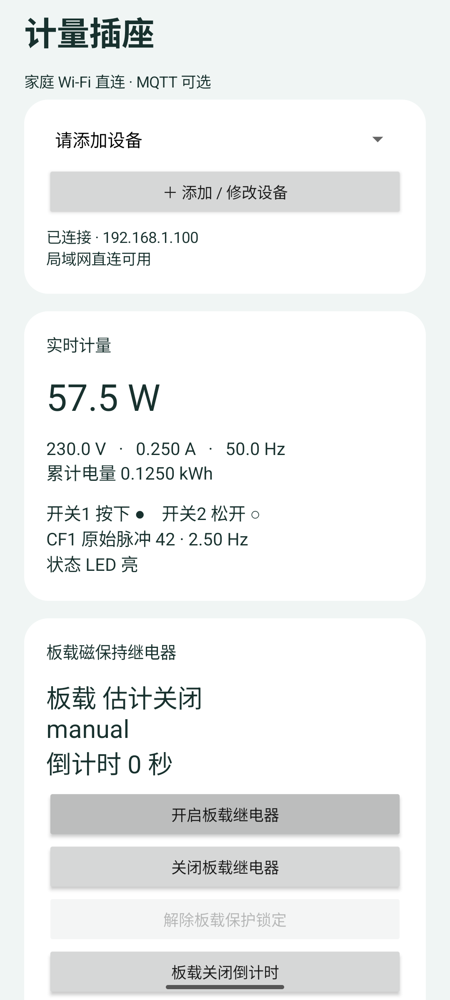 | 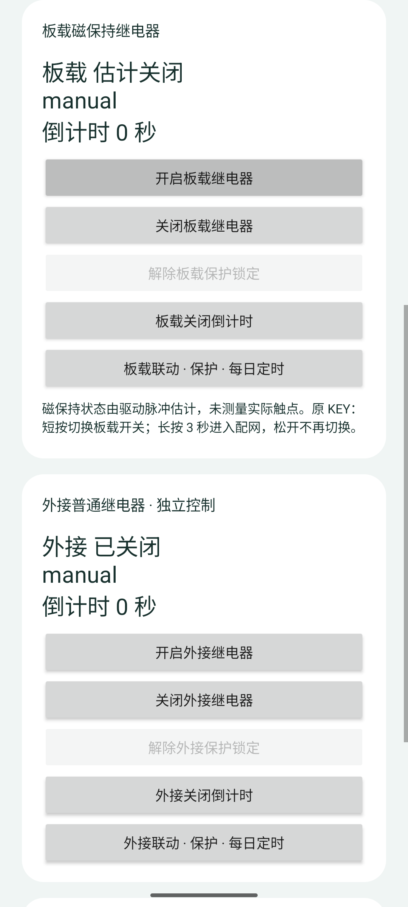 | 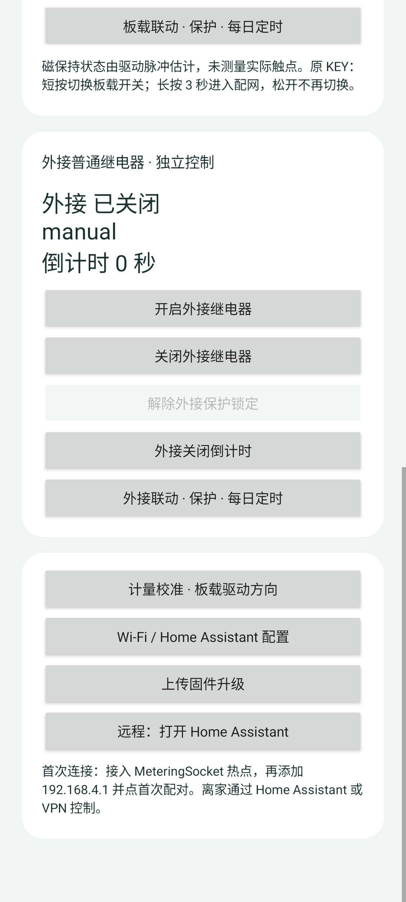 |

主页显示共享计量、两路微动输入、CF1 和状态灯。板载状态由脉冲估计，外接通道没有独立计量。原 KEY 短按切换板载，长按三秒配网。

| 设置入口 | 添加与配对设备 |
|---|---|
| 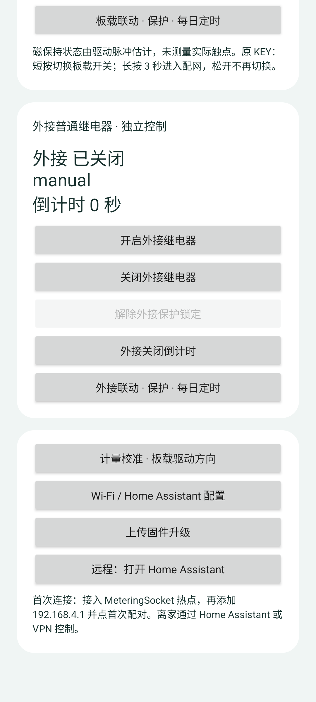 | 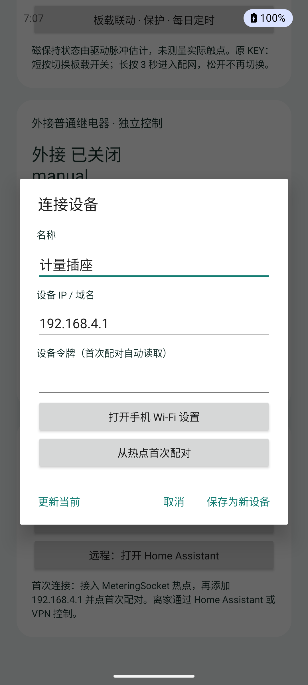 |

首次配对在设备热点内读取令牌；日常可在没有 MQTT 服务的情况下通过局域网 HTTP 使用。这里的名称与地址仅为示例。

| 板载联动、保护和每日定时 | 外接联动、保护和每日定时 |
|---|---|
| 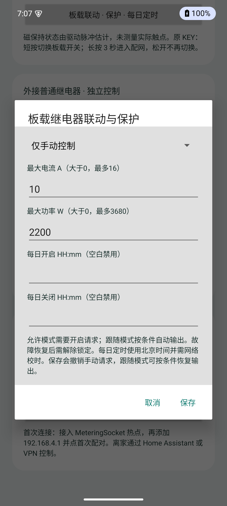 | 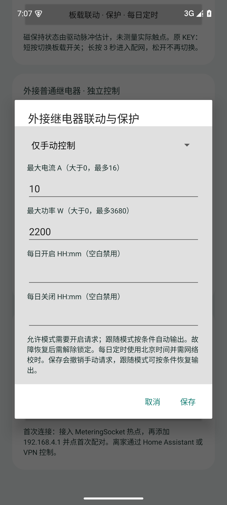 |

两路独立设置七种规则、电流与功率阈值、每日开启和关闭时间。每日定时采用北京时间，需网络校时。

| 板载关闭倒计时 | 外接关闭倒计时 |
|---|---|
| 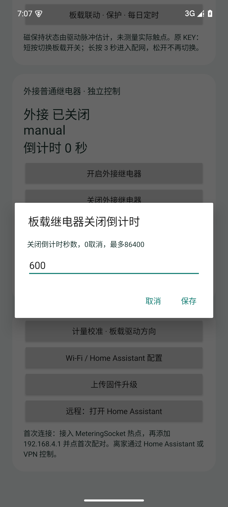 |  |

倒计时独立，0 表示取消，最多 86400 秒。

| 计量校准与板载方向 | Wi-Fi 与 MQTT 配置 |
|---|---|
| 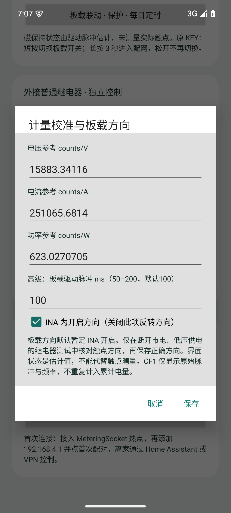 | 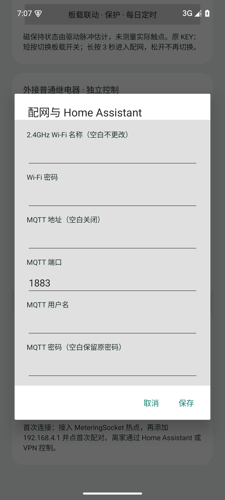 |

方向与脉冲参数需要在低压实物测试中确认；参考值不是每块板的校准结果。MQTT 可选，启用后用于 Home Assistant 自动发现。

| Home Assistant 入口 | OTA 升级确认 |
|---|---|
| 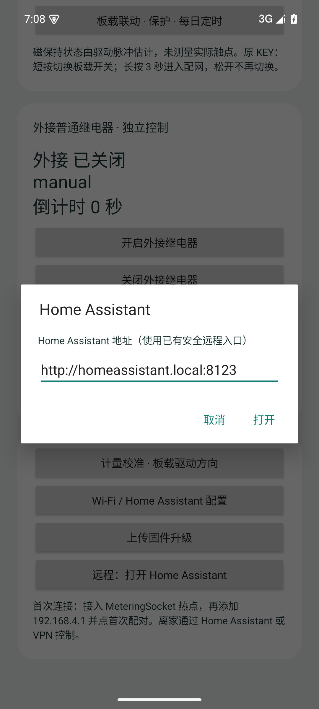 | 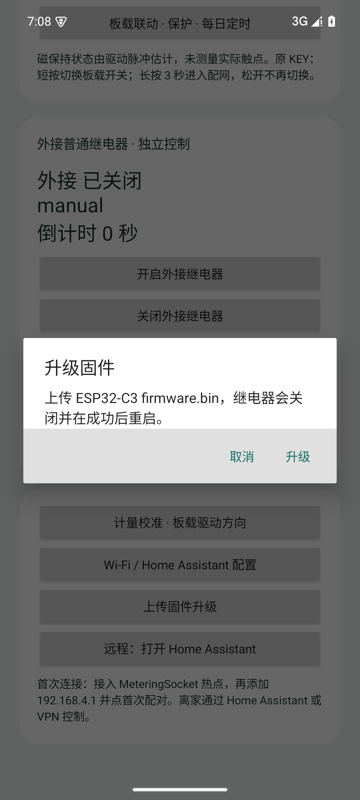 |

远程入口需自行配置已有安全访问方式。升级选择 OTA 应用镜像 `firmware.bin`，不要选择首次烧录整片镜像。截图只展示确认弹窗，未执行上传。

## 重新生成

安装当前 APK 和 Android instrumentation APK，在已启动的模拟器中执行：

```powershell
adb shell am instrument -w -e class com.topsai.meteringsocket.ScreenshotTest com.topsai.meteringsocket.test/android.test.InstrumentationTestRunner
adb pull /sdcard/Android/data/com.topsai.meteringsocket/files/screenshots/. docs/images/android
```

生成器只向真实视图填入演示状态并打开弹窗，不操作真实插座或提交配置。捕获后仍需检查遮挡、凭据和文字可读性。
